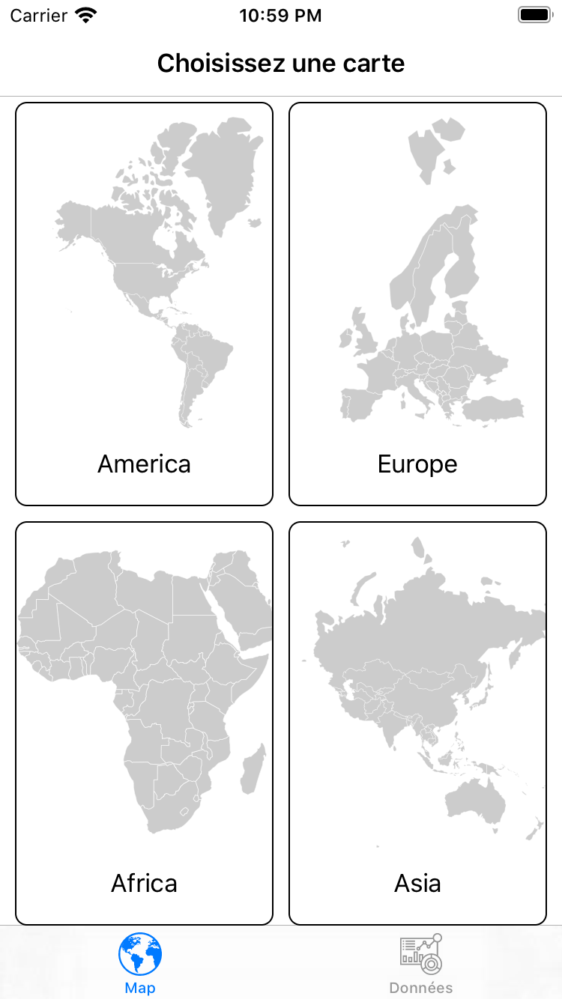
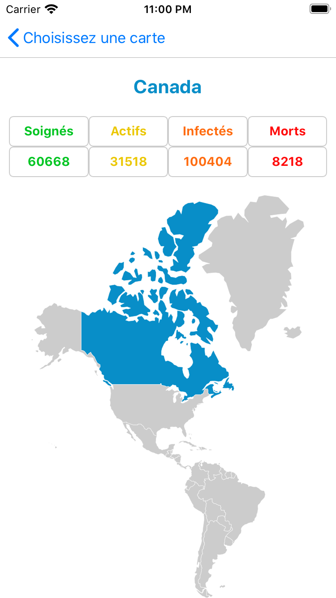
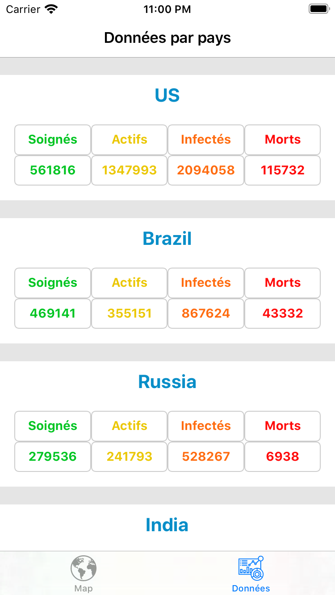

# Covid-19 App

## Description

Il s'agit d'une application iPhone, codée en swift, permettant de suivre l'évolution de la pandémie du Covid-19 dans le monde. L'application propose deux manières pour visualiser les données. Une première, où l'utilisateur peut sélectionner une zone du monde, puis le pays sur lequel il souhaite obtenir des informations. La seconde méthode est simplement une liste des pays avec des données sur leurs situations. Il s'agit de ma première application Swift.

## Origine des données

L'application Swift, fait appel à une API NodeJS, afin d'obtenir les données sur les différents pays. L'API est alimentée grâce aux données présentes sur le dépôt suivant:

https://github.com/CSSEGISandData/COVID-19

## Lancement de l'application

Pour utiliser l'application, il est donc nécessaire de lancer l'API. Cela peut se faire en installant les dépendances, puis en lançant l'API directement sur la machine:

```
npm install
npm run start
```

ou avec Docker en exécutant la commande suivante à la racine du dépôt:

```
docker-compose build && docker-compose up
```

L'addresse de l'API doit être renseignée dans le fichier "Constants.swift" de l'application mobile.

Ensuite, le lancement de l'application mobile, peut se faire normalement depuis Xcode pour la lancer sur le simulateur ou un iPhone connecté au Mac

## Captures d'écran



